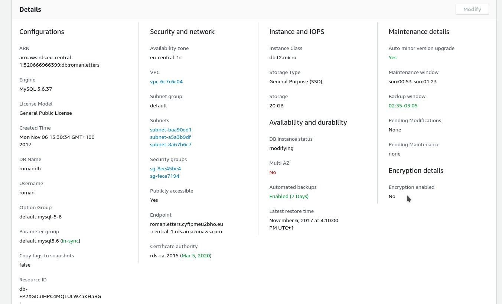
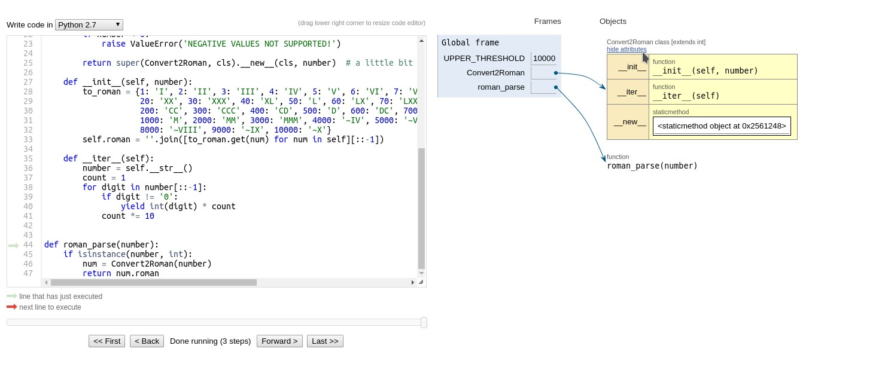
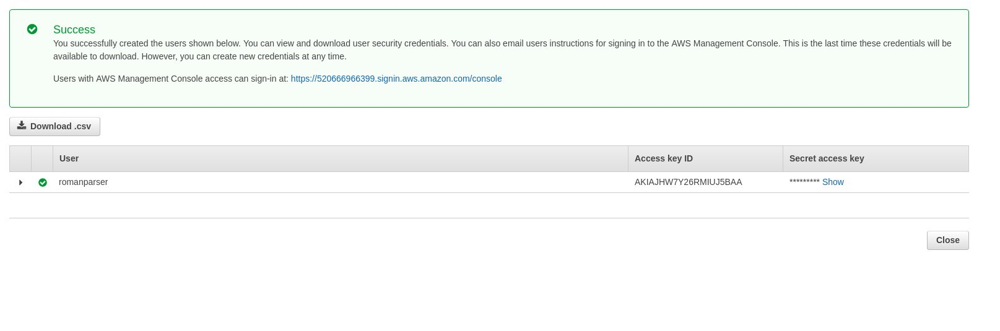
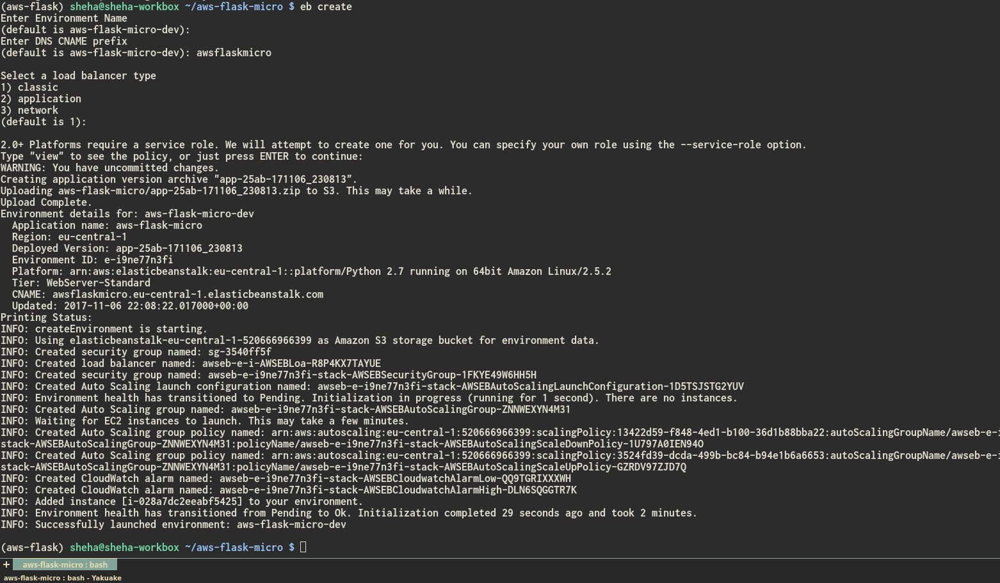

### Roman Numerals Challenge.

Solution to the challenge, written in Python, utilizing Flask MicroFramework, fully deployed on AWS.

Uses MySql instance on RDS (Free-Tier, 7 day persistence, 5GB, only one server instance).

The code itself is deployed on AWS Elastic Beanstalk infrastructure, also Free-Tier.
There are screenshots in this file, which show the infrastructure and solution architecture details.

The solution itself is in worker.py, wrapped in boilerplate Flask code, to be usable as an exposed
API on AWS.

It is possible to run it locally, by commenting out the AWS RDS portion of the code in config.py and following
the steps below:

First, clone the repo locally.

Create a virtualenv for the project
```
$ virtualenv aws-flask
$ source aws-flask/bin/activate
```
Now install the required modules:
```
$ pip install -r requirements.txt
```

 Edit ```config.py``` by commenting out the AWS URL and uncomment this line:
```
SQLALCHEMY_DATABASE_URI = 'sqlite:///test.db'
```
Next run:
```
$ python db_create.py
```
And the tables are created.  Now you can launch the app:
```
$ python application.py
```
And point your browser to http://0.0.0.0:5000.

Voila.

Using the bottom form, you can see the last 1 to 9 entires of the database in reverse chronological order.

IMPORTANT: For the >=4K values, I am using the ~IV, ~V, ~VI... ~X roman notation, instead of the canonical, where the big
literals have a dash above - this is for keeping it simple.

####Screenshots:

RDS:


Solution execution:



####DEPLOYMENT:

boto - aws AIO.

awsebcli - elastic deployment. 

Short Deployment steps:

Create a new user for the app in the AWS Management Console, add it to/create a group with Administrative Access.

Use the given access credentials in further setup:


```$ eb init ```

Choose the location closest to you, mine is eu-central,
ignore the error,

now is the time to enter your credentials, as mine in the pic above.

Leave the app name default, choose Python 2.7.
I left the ssh access locked, can be changed later.

Next, do
```eb create```

Here is a screenshot of a successful deployment:


This app is available for testing and playing around at:
```http://awsflaskmicro.eu-central-1.elasticbeanstalk.com```

With my public repo here:

```https://github.com/sheha/aws-flask-micro```

Hope you like it, it's simple and effective.

Regards, Ismar Sehic, Sarajevo


